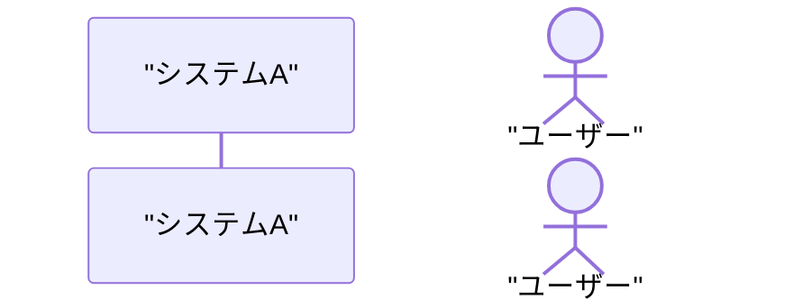
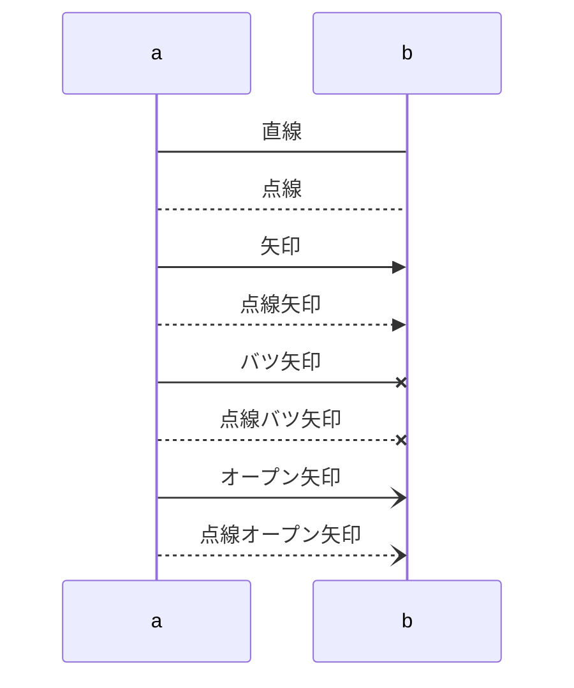
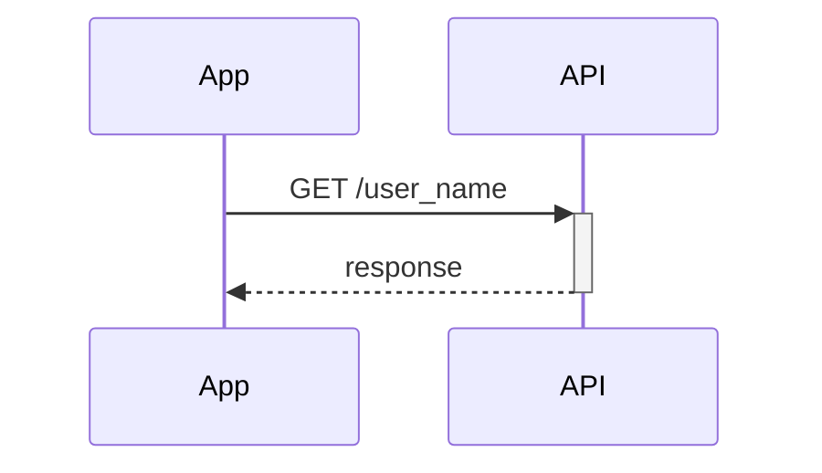
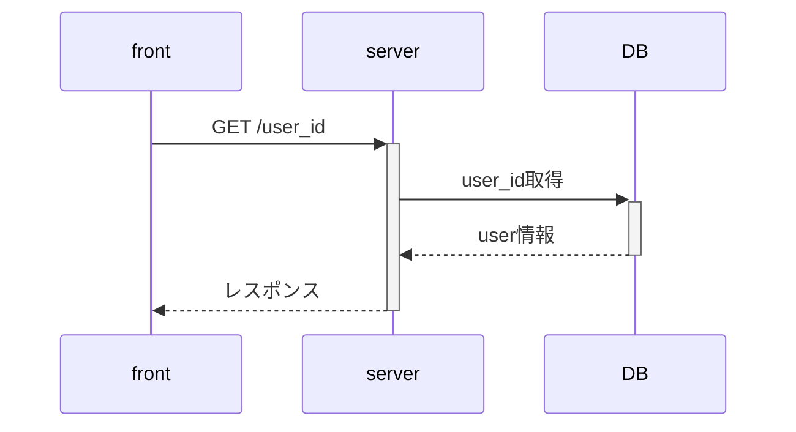

# システム開発におけるシーケンス図が役立つとき
システム開発では、**「誰が」** **「いつ」** **「何を」** するのかを時系列で表現したい時がある。
例えば、
- API連携の流れを明確にしたい
- 非同期処理の順序を表現したい
- マイクロサービス間の通信を図示したい
- レガシーコードの動作を理解し共有したい

こんな場面でシーケンス図は非常に役立ちます！

## シーケンス図の文法

- `sequenceDiagram` で宣言
- `participant` は使用するモジュールや人物を指す
- `actor`で人物を指すことになる
- `as`はラベル代わりになる
  
## 矢印の意味

| 矢印の種類       | 見方       |
|----------------|----------|
| 直線、矢印       | 同期処理で利用  |
| 点線、点線矢印   | レスポンスで利用|
| オープン矢印・点線オープン矢印 | 非同期処理で使われる |

## 活性・非活性

- `+``-` を入れることで一つの処理がどこまであるのかがわかる

## 例： APIのリクエスト・レンスポンス

## 条件分岐とループ

## 並列処理

## 例

### OAuth2の認証フロー

### 非同期処理（メッセージキュー）